# Assignment 1 — Frontend

**Name:** Ingkar Tolegen
**Group:** Group: SE-2540
**GitHub Repository:** [https://github.com/InkarTolegen2/Assignment1-WEB1.git](https://github.com/InkarTolegen2/Assignment1-WEB1.git) 
**Published Website:** [https://github.com/InkarTolegen2/Assignment1-WEB1](https://github.com/InkarTolegen2/Assignment1-WEB1)

## Objective
To learn the basics of HTML and CSS: HTML document structure, text tags, lists, images, links, tables, forms, CSS selectors, box model, positioning, float, and website publishing via GitHub Pages.

## Part 1. Introduction to HTML
### Step 0. Basic HTML boilerplate
Added `<!DOCTYPE html>`, `<html>`, `<head>`, `<title>`, `<body>`.
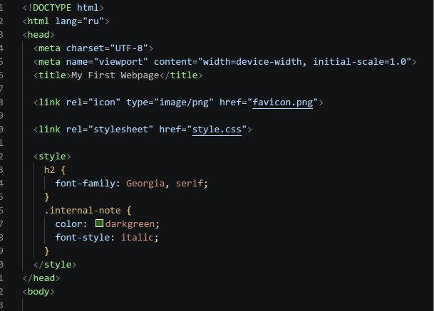

### Step 1. Headings and paragraph
Added `<h1>`-`<h3>` and a paragraph about me.
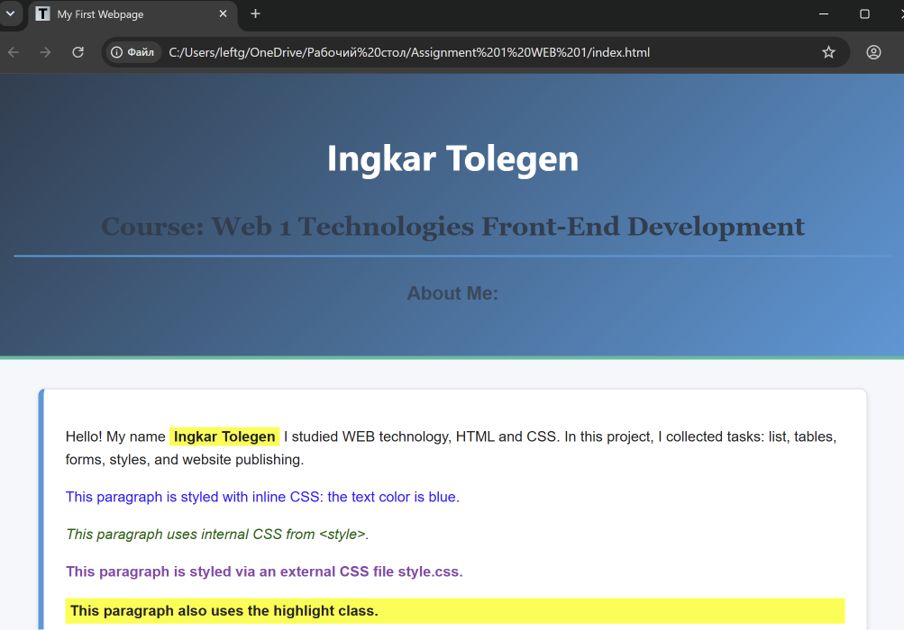

### Step 2. Lists
Created an ordered list and an unordered list.
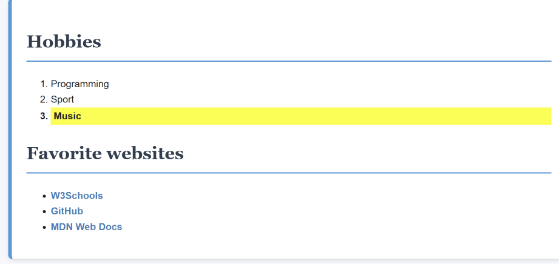

### Step 3. Images and links
Added a photo and at least two links.
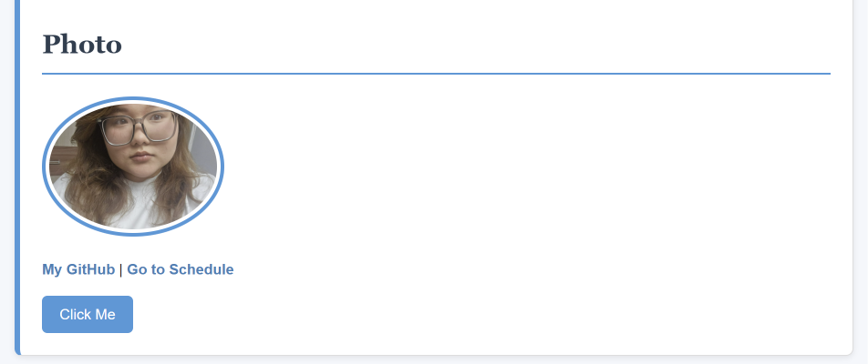

### Step 4. Button
Added a "Click Me" button.

## Part 2. Intermediate HTML
### Step 5. Table
Created a "Subject / Day / Time" table.
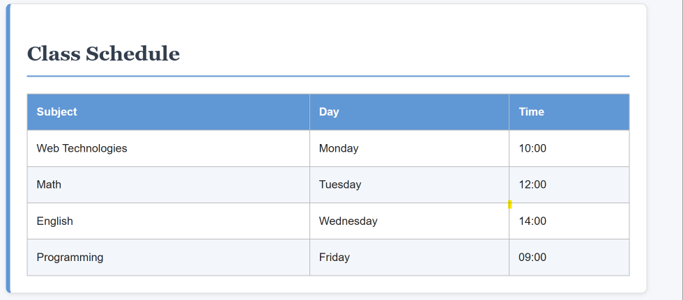

### Step 6. Table layout
Created a two-column layout using a table.
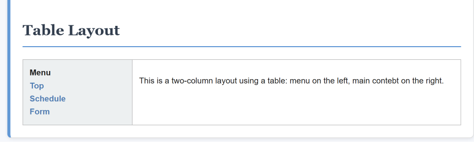

### Step 7. Emojis
Added at least 3 emojis.
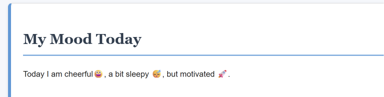

### Step 8. Form
Created a form: Name, Email, Favorite Color, Submit.
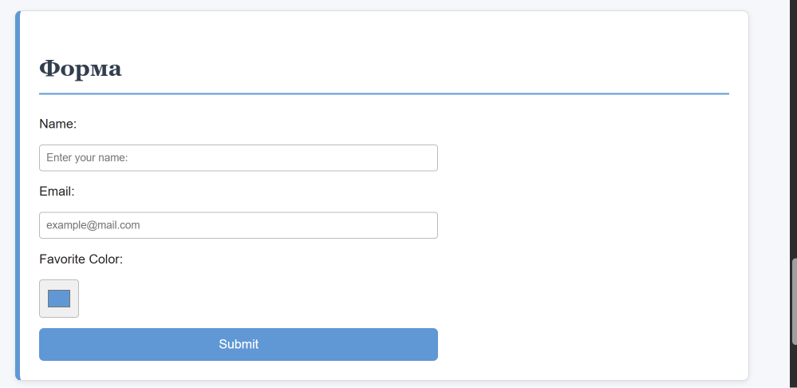

## Part 3. Introduction to CSS
### Step 9-12. Inline, internal, external CSS
Used inline style, `<style>`, and `style.css`.
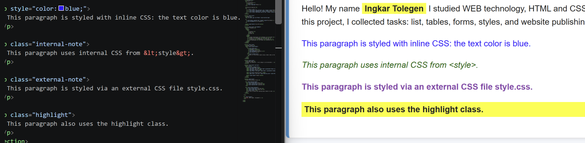

### Step 13-14. Selectors, classes, IDs
Used element selectors, `.highlight`, `#main-heading`.
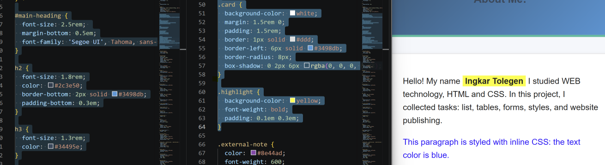

## Part 4. Intermediate CSS
### Step 15. Favicon
Connected `favicon.png`.

### Step 16. Divs
Used divs for header, main content, and footer.
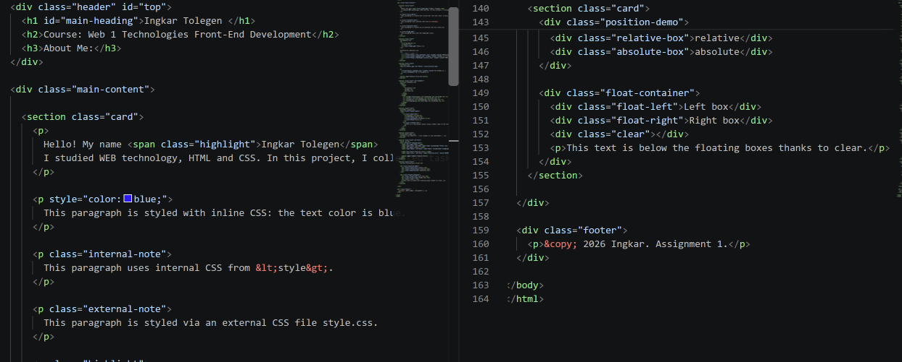

### Step 17. Box model
Added margin, padding, border.
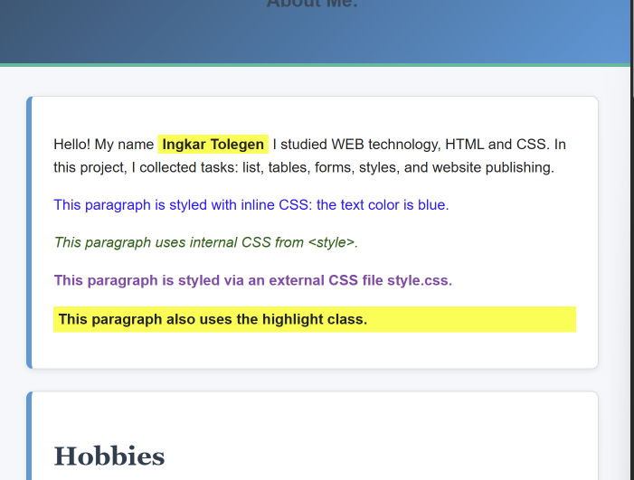

### Step 18. Positioning
Used static, relative, absolute.
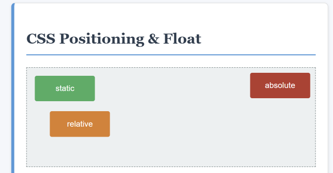

### Step 19. Sizing
Used px, %, em, rem.
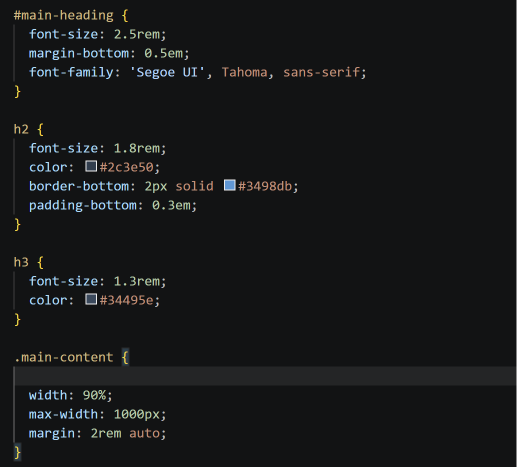

### Step 20. Float and clear
Created two floated boxes and added clear.
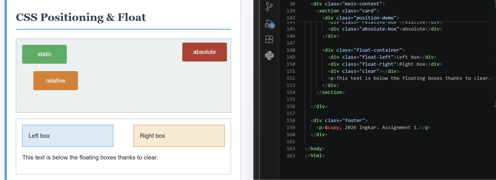

### Step 21. GitHub Pages
Website is published via GitHub Pages.
**Published URL:** [https://username.github.io/assignment1/](https://github.com/InkarTolegen2/Assignment1-WEB1)

## Work Summary
During this work, I created an HTML page, added lists, tables, a form, an image, links, and a button. Then I connected an external CSS file, used inline and internal CSS, classes and IDs, the box model, positioning, and float. After testing, the site was uploaded to a public GitHub repository and published via GitHub Pages.

## Reflection
I learned how to structure an HTML document, connect CSS in different ways, and publish a website online.